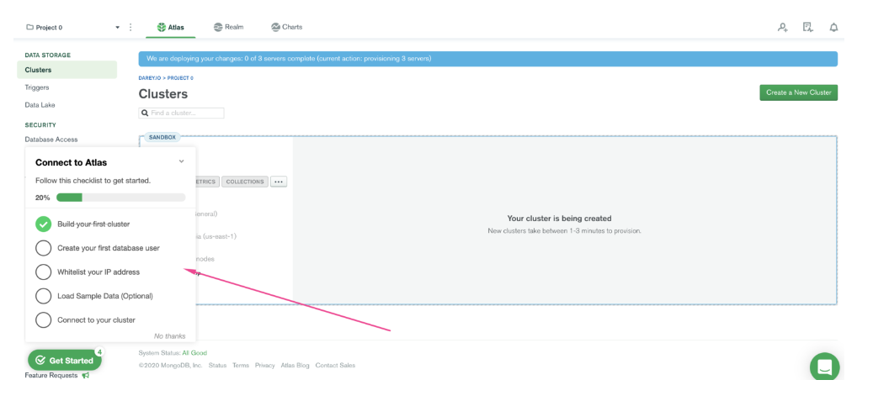
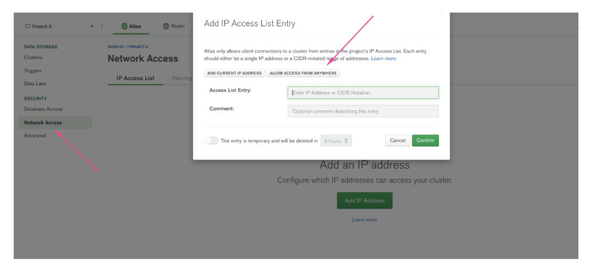
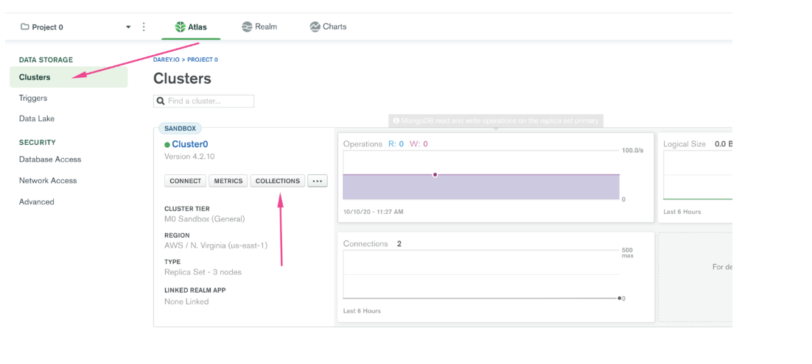
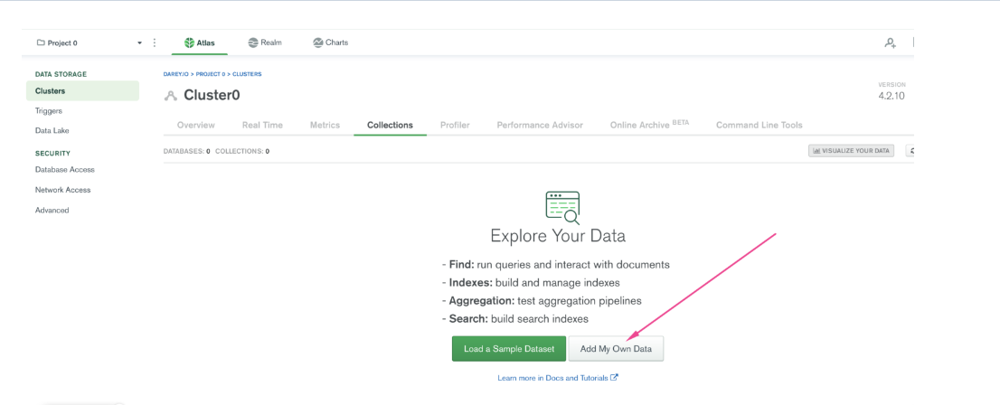
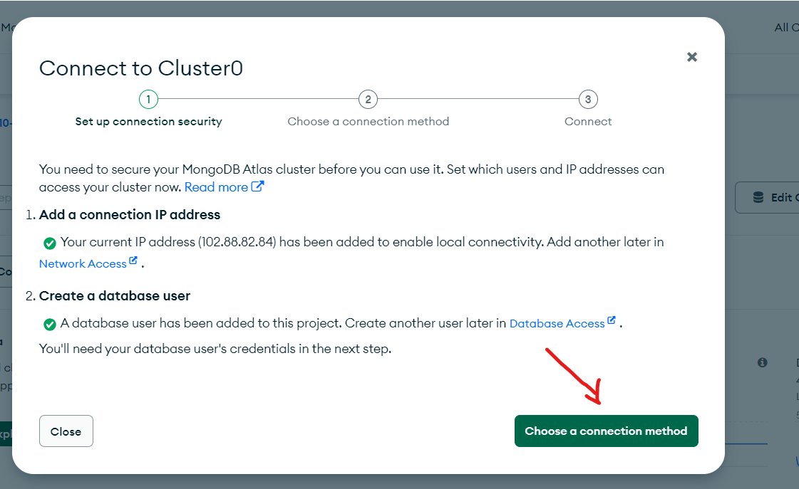
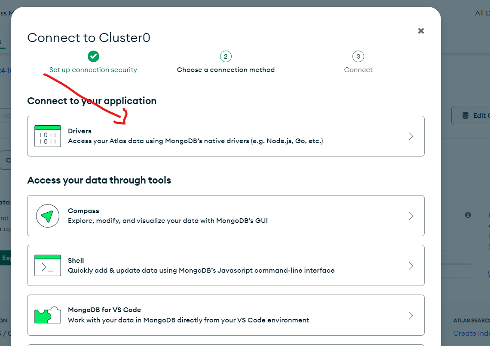
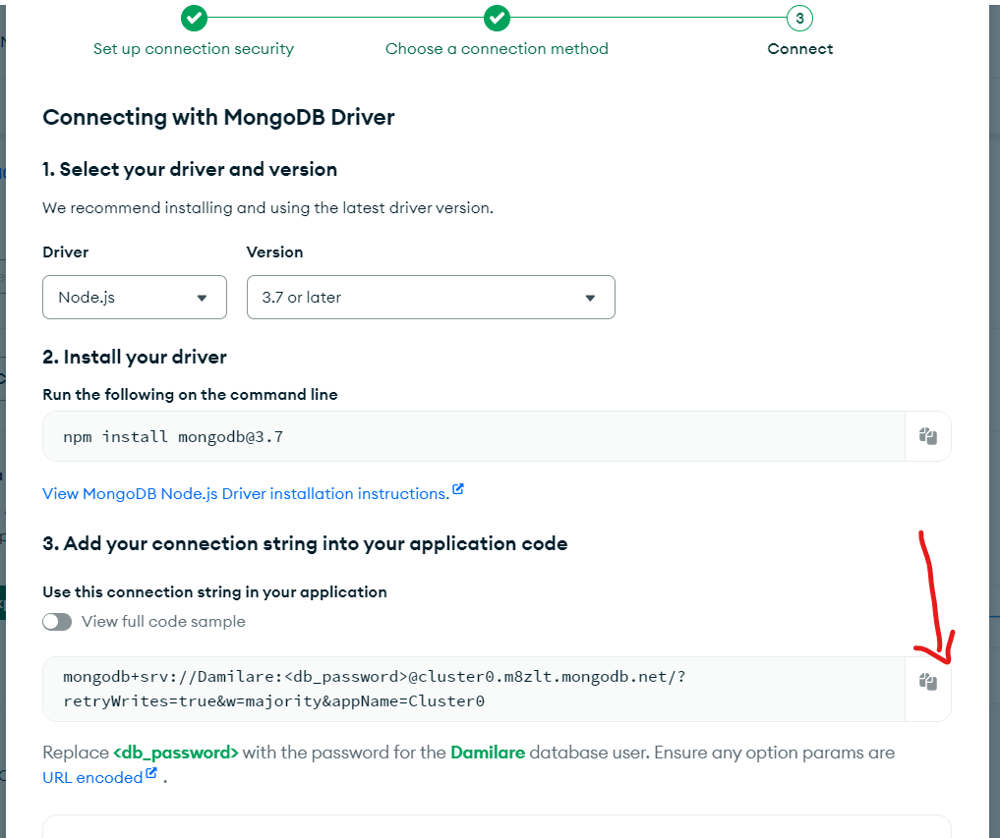
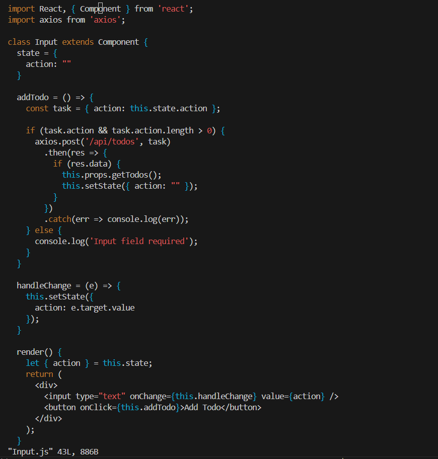
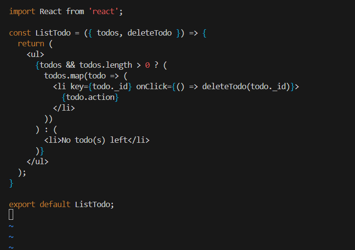

# WEB-STACK-IMPLEMENTATION-MERN-STACK-IN-AWS

## Purpose of this project:

This project helps to further develop deep understanding on the following

1. Understanding on web technology stack such as MERN
2. Components of MERN Stack: MongoDB, ExpressJS, ReactJS, NodeJS
3. How the MERN stack works
4. To deploy a simple TO-DO application that creates a TO-DO list

## What is MERN Stack?

    The MERN stack is a popular web development stack that consists of four key technologies used for building full-stack web applications. MERN stands for:

### MongoDB:

- A NoSQL database that stores data in flexible, JSON-like documents.
- It's used to store application data and is highly scalable, making it ideal for handling large volumes of data.

### Express.js:

- A backend web application framework for Node.js.
- It provides a lightweight, robust set of features for building web applications and APIs. It handles server-side logic and communication between the front-end and the database.

### React:

- A JavaScript library used to build the user interface (UI), specifically for handling the front-end of the application.
- Developed by Facebook, it allows for the creation of dynamic and responsive user interfaces with reusable components.

### Node.js:

- A JavaScript runtime that allows developers to run JavaScript on the server-side.
- It enables the development of scalable and high-performance backend applications and APIs.

## How the MERN Stack Works:

### Frontend (React):

The React component of the stack handles the user interface (UI). It interacts with users, collects inputs, and displays information from the backend.

### Backend (Node.js & Express.js):

Express.js, running on Node.js, manages the server-side logic. It processes incoming HTTP requests, connects with the database, and serves the necessary data back to the front-end.

### Database (MongoDB):

MongoDB stores data in JSON-like documents. When users submit data through the front-end, the backend processes and stores it in MongoDB, and retrieves data as needed.

### Example:

A MERN stack application could be a web app where users can register, log in, and manage their profiles.

## Steps Involved:

- **Step 0:** Preparing Prerequisite. Creating an AWS account and a virtual server with Ubuntu Server OS.
- **Step 1:** Backend Configuration

## Step 0: Preparing Prerequisite.

Create an AWS account and a virtual server with Ubuntu Server OS.
The same process used during the LEMP project was used here.

## Step 1: Backend Configuraion

1.**update and upgrade Ubuntu**

    sudo apt update
    sudo apt upgrade

2.**Get the location of Node.js software from Ubuntu repositories.**

    curl -fsSL https://deb.nodesource.com/setup_18.x | sudo -E bash -

3.**Install node.JS with the command below**

    sudo apt-get install nodejs -y

**Note:** The command above installs both nodejs and npm. NPM is a package manager for Node
like apt for Ubuntu, it is used to install Node modules & packages and to manage dependency conflicts.

4.**Verify the node installation with the two commands below**

    node -v
    npm -v

### APPLICATION SET-UP

5.**Create a new directory for the TO-DO project**

    mkdir Todo

6.**Use the command below to confirm the Todo directory has been created**

    ls

**TIP:** _In order to see some more useful information about files and directories, you can use
following combination of keys 1s -lih - it will show you different properties and size in human
readable format. You can learn more about different useful keys for 1s command with 1s -- help._

    ls -lih

**Result**

**Meaninig:** This command is listing a directory called Todo which is 4.0 KB in size, last modified on October 13 at 21:59. It has read, write, and execute permissions for the owner and group, while others can only read and execute. The directory is owned by the user ubuntu and the group ubuntu.

7.**Change the directory to the newly created one**

    cd Todo

8.**Use the command below to initialize the project and also create a new file _package.json_**

    npm init

**Note** _This file will normally contain information about your application
and the dependencies that it needs to run. Follow the prompts after running the command. You
can press Enter several times to accept default values, then accept to write out the package. json file
by typing yes._

9.**Use the ls command to confirm that the package.json file has been created**

    ls

## Step 2: Installing Express.JS and Creation of Routes Directory

### 1. Install ExpressJS using npm

**Reason for using npm**

Remember that Express is a framework for Node.js, therefore a lot of things developers would have programmed is already taken care of out of the box. Therefore it simplifies development, and abstracts a lot of low level details. For example, Express helps to define routes of your application based on HTTP methods and URLs.

    npm install express

- **Create a file index.js with the command below**

  touch index.js

- **Confirm that the index.js file was created**

  ls

- **Install the _dotenv_ module**

  npm install dotenv

  

- **Open the index.js file**

  vim index.js

- **Paste the code below into the file**

  const express = require ('express');
  require('dotenv') .config ();

  const app = express ();

  const port = process.env. PORT | | 5000;

  app.use ((req, res, next) => {
  res.header ("Access-Control-Allow-Origin", "\*");
  res.header ("Access-Control-Allow-Headers", "Origin, X-Requested-With, Content-Type, Accept");
  next ();
  });

  app.use((req, res, next) => {
  res.send ('Welcome to Express');
  });

  app.listen (port, () => {
  console.log ('Server running on port ${port}')
  });

**Note:** Notice that we have specified to use port 5000 in the code. This will be required later when we go on
the browser.

Use :w to save in vim and use : qa to exit vim

Now it is time to start our server to see if it works. Open your terminal in the same directory as your index.js file and type

    node index.js

- **Access the server in the public Ip or public DNS**

  http://<public ip or public DNS>:5000

### Output

### 2. Create Routes

**Tip** There are three actions that our To-Do application needs to be able to do:

1. Create a new task

2. Display list of all tasks
3. Delete a completed task

Each task will be associated with some particular endpoint and will use different standard **HTTP
request methods**: POST, GET, DELETE.

For each task, we need to create _routes_ that will define various endpoints that the **To-do** app will
depend on. So let us create a folder _routes_

    mkdir routes

- **Change the Directory to routes folder**

        cd routes

- **Create a file _api.js_ in the routes folder**

        touch api.js

- **Open the file with the _vim api.js_ command and paste the code below into it**

        const express = require ('express');
        const router = express.Router();

        router.get('/todos', (req, res, next) => {

        });

        router.post('/todos', (req, res, next) => {

        });

        router.delete('/todos/:id', (req, res, next) => {

        })

        module.exports = router;

  

### 3. Create Model Directory

Note: Since the app is going to make use of Mongodb which is a NoSQL database, we need to create a model.

A model is at the heart of JavaScript based applications. We will also use models to define the database schema . This is important so that we will be able to define the fields stored in each Mongodb document.

The Schema is a blueprint of how the database will be constructed, including other data
fields that may not be required to be stored in the database. These are known as virtual properties

To create a Schema and a model, install mongoose which is a Node.js package that makes
working with mongodb easier.

- **Change the directory back to _Todo_ folder with cd .. and install Mongoose using npm**

  

        npm install mongoose

  

- **Create a folder _models_ with the mkdir command**

        mkdir models

- **Change the directory to the newly created folder**

        cd models

  

- **Create a file _todo.js_ with touch command**

        touch todo.js

- **Open the file**

        vim todo.js

  

**Note** There is need to update our routes from the file api. js in 'routes' directory to make use of the new model.

In Routes directory, _open api.js_ with _vim api.js_, delete the code inside with _:%d_ command and paste the code below into it then save and exit

- **Go back to the _routes_ directory**

  cd routes

- **Open the api.js file with _vim api.js_ and delete the code inside with :%d command then paste the code below and save it**

        const express = require ('express');
        const router = express.Router();
        const Todo = require('../models/todo');

        router.get('/todos', (req, res, next) => {

        //this will return all the data, exposing only the id and action field to the client
        Todo.find({}, 'action')
        .then(data => res.json(data))
        .catch(next)
        });

        router.post('/todos', (req, res, next) => {
        if(req.body.action){
        Todo.create(req.body)
        .then(data => res.json(data))
        .catch(next)
        }else {
        res.json({
        error: "The input field is empty"
        })
        }
        });

        router.delete('/todos/:id', (req, res, next) => {
        Todo.findOneAndDelete({"_id": req.params.id})
        .then(data => res.json(data))
        catch(next)
        })

        module.exports = router;

## Step 3: Setting up MongoDB database.

### 1. Sign up for a shared cluster free account with mLab

_Note: A database is needed to store our data. For this project, we'll use mLab. mLab provides MongoDB database as a service solution (DBaaS)_.

_Follow the
sign up process, select AWS as the cloud provider, and choose a region near you._

_Complete a get started checklist as shown in the image below_

Allow access to the MongoDB database from anywhere (Not secure, but it is ideal for testing)

IMPORTANT NOTE In the image below, make sure you change the time of deleting the entry from 6Hours to 1 Week

- **Create a MongoDB database and collection inside mLab**

- **Create a file in your Todo directory and name it .env.**

      touch .env

      vi .env

- **Add the _connection string_ to access the database in it, just as below:**

_Ex: DB=mongodb+srv://<username> :< password>@<network-address>/<dbname>?
retryWrites=true&w=majority_

_Note: Ensure to update <username>, <password>, <network-address> and <database> according to your setup_

      DB=mongodb+srv://Damilare:<db_password>@cluster0.m8zlt.mongodb.net/Damilare?retryWrites=true&w=majority&appName=Cluster0

-**Here is how to get the connection string**

Now we need to update the index. js to reflect the use of .env so that Node.js can connect to the
database.

Simply delete existing content in the file, and update it with the entire code below.

To do that using vim, follow below steps

1. Open the file with vim index. js
2. Press esc
3. Type :
4. Type %d
5. Hit 'Enter'

The entire content will be deleted, then,

6.  Press i to enter the insert mode in vim
7.  Now, paste the entire code below in the file.

            require('dotenv').config();
            const express = require('express');
            const mongoose = require('mongoose');
            const routes = require('./routes');
            const app = express();

            const port = process.env.PORT || 5000;

            console.log("DB URI:", process.env.DB);

            //connect to the database
            mongoose.connect(process.env.DB, {

              useNewUrlParser: true,
              useUnifiedTopology: true
            })
            .then(() => console.log(`Database connected successfully`))
            .catch(err => console.log (err));

            //since mongoose promise is depreciated, we overide it with node's promise
            mongoose.Promise = global.Promise;

            app.use((req, res, next) => {
              res.header("Access-Control-Allow-Origin", "\*");
              res.header("Access-Control-Allow-Headers", "Origin, X-Requested-With, Content-Type, Accept");
              next();
            });

            app.use(express.json());

            app.use('/api', routes);

            app.use((err, req, res, next) => {
            console.log(err);
              res.status(500).send({ error: 'Something went wrong!' });
              next();
            });

            app.listen(port, () => {
              console.log(`Server running on port ${port}`)
            });

**Note: Using environment variables to store information is considered more secure and best practice to
separate configuration and secret data from the application, instead of writing connection strings
directly inside the _index.js_ application file.**

### 2. Start the server by using the command below

    node index.js

This should display a message **Database Connected successfully** If so, the Backend and Database has been configure successfully.

## Step 4: Testing Backend Code without Frontend using RESTful API

During creation of our Frontend, we'll need to test our code using RESTFulL API. Hence, we'll make use of **postman** to test our API.

### 1. Download and Install postman.

**Test the Backend part of the To-Do application by carrying out the following operations**

- Add a new task to the list - HTTP POST request
- Display a list of tasks - HTTP GET request
- Delete an existing task from the list - HTTP DELETE request

### 2. Open Postman, create a POST request to the API http://<PublicIP-or-PublicDNS>:5000/api/todos.

_This request sends a new task to our To-Do list so the application can store it in the database._

**Note: Make sure the header key is set to _Content-Type_ as _application/json_**

### 3. Create a GET request to the API http://<PublicIP-or-PublicDNS>:5000/api/todos

_This request retrieves all existing records from out To-do application (backend requests these records from the database
and sends it us back as a response to GET request)._

### 4. Create a DELETE request to the API http://<PublicIP-or-PublicDNS>:5000/api/todos/id

**Note** _Remember to use the valid **id** in the Database_

## Step 5: Frontend Creation

**Let us create the frontend of the To-do app, we will use the _create-react-app_ command to scaffold our app.**

**Create a user interface for a Web client (browser) to interact with the application via API.**

** Paste the command below into the Todo directory**

_This will create a new folder in your Todo directory called client, where you will add all the react code._

    npx create-react-app client

- **Running a React app**

Before testing the react app, there are some dependencies that need to be installed.

1.  Install **concurrently**. It is used to run more than one command simultaneously from the same
    terminal window.

         npm install concurrently --save-dev

2.  Install **nodemon**. It is used to run and monitor the server. If there is any change in the server
    code, nodemon will restart it automatically and load the new changes.

        npm install nodemon --save-dev

3.  In Todo folder open the **package.json** file. Change the highlighted part of the below screenshot
    and replace with the code below.

    

        "scripts": {
        "start": "node index.js",
        "start-watch": "nodemon index.js",
        "dev": "concurrently \"npm run start-watch\" \"cd client && npm start\""
        }

- **Configure Proxy in package.json file**

1.  Change directory to 'client'

        cd client

2.  Open the package. json file

        vi package.json

3.  Add the key value pair in the package.json file

        "proxy": "http://localhost:5000".

The proxy configuration is added to make it possible to access the application directly from the browser by simply calling the server ur like http://localhost:5000 rather than always including the entire path like http://localhost:5000/api/todos

- **Open TCP port 3000 on EC2**

- **Go back to the Todo directory and run the command below**

        npm run dev

**Note: Your app should open and start running on localhost:3000 or public ip:3000**

## Step 6: Creating React Components.

In React, a component is a reusable, self-contained piece of the user interface that defines how a part of your application should look and behave. Components allow you to split the UI into independent, isolated sections that can be managed and updated independently.

One of the advantages of react is that it makes use of components, which are reusable and also
makes code modular. For our Todo app, there will be two stateful components and one stateless
component.

- **From your Todo directory move to the client directory then to src directory**

      cd client/src

-**In the src folder, craete another folder _components_**

      mkdir components

-**Move to components directory**

      cd components

-**Inside 'components' directory create three files Input. js, ListTodo. js and Todo. js.**

      touch Input. js, ListTodo. js and Todo. js

-**Let's treat the files one after the other**

-**Open Input.js file**

      vi Input.js

-**Paste the code below into it and save it**

        import React, { Component } from 'react';
        import axios from 'axios';

        class Input extends Component {
          state = {
            action: ""
          }

          addTodo = () => {
            const task = { action: this.state.action };

            if (task.action && task.action.length > 0) {
              axios.post('/api/todos', task)
                .then(res => {
                  if (res.data) {
                    this.props.getTodos();
                    this.setState({ action: "" });
                  }
                })
                .catch(err => console.log(err));
            } else {
              console.log('Input field required');
            }
          }

          handleChange = (e) => {
            this.setState({
              action: e.target.value
            });
          }

          render() {
            let { action } = this.state;
            return (
              

                <input type="text" onChange={this.handleChange} value={action} />
                <button onClick={this.addTodo}>Add Todo</button>
              

            );
          }
        }

        export default Input;

- **Open ListTodo.js, paste the code below into it and save it**

      import React from 'react';

      const ListTodo = ({ todos, deleteTodo }) => {
        return (
          <ul>
            {todos && todos.length > 0 ? (
              todos.map(todo => (
                <li key={todo._id} onClick={() => deleteTodo(todo._id)}>
                  {todo.action}
                </li>
              ))
            ) : (
              <li>No todo(s) left</li>
            )}
          </ul>
        );
      }

      export default ListTodo;

- **Open Todo.js, paste the code below into it and save it**

      import React, { Component } from 'react';
      import axios from 'axios';
      import Input from './Input';
      import ListTodo from './ListTodo';

      class Todo extends Component {
        state = {
          todos: []
        };

        componentDidMount() {
          this.getTodos();
        }

        getTodos = () => {
          axios.get('/api/todos')
            .then(res => {
              if (res.data) {
                this.setState({
                  todos: res.data
                });
              }
            })
            .catch(err => console.log(err));
        }

        deleteTodo = (id) => {
          axios.delete(`/api/todos/${id}`)
            .then(res => {
              if (res.data) {
                this.getTodos();
              }
            })
            .catch(err => console.log(err));
        }

        render() {
          let { todos } = this.state;

          return (
            

              <h1>Todo List</h1>
              <Input getTodos={this.getTodos} />
              <ListTodo todos={todos} deleteTodo={this.deleteTodo} />
            

          );
        }
      }

      export default Todo;

- **Install axios to make use of Axios which is a Promise based HTTP client for the browser and node.js.**

**Move to client folder**

      cd../..

- **Install Axios**

      npm install axios

There is need to make little adjustment to our react code. Delete the logo and adjust our App. js to look
like this.

- **Move to the src folder**

      cd src

- **Open App.js and paste the code below into it then save it**

        vi App.Js

          import React from 'react';
          import Todo from './components/Todo';
          import './App.css';

          const App = () => {
            return (
              

                <Todo />
              

            );
          };

          export default App;

- **Open App.css with _App.css_ and paste the code below into it then save it**

          .App {
            text-align: center;
            font-size: calc(10px + 2vmin);
            width: 60%;
            margin-left: auto;
            margin-right: auto;
          }

          input {
            height: 40px;
            width: 50%;
            border: none;
            border-bottom: 2px #101113 solid;
            background: none;
            font-size: 1.5rem;
            color: #787a80;
          }

          input:focus {
            outline: none;
          }

          button {
            width: 25%;
            height: 45px;
            border: none;
            margin-left: 10px;
            font-size: 25px;
            background: #101113;
            border-radius: 5px;
            color: #787a80;
            cursor: pointer;
          }

          button:focus {
            outline: none;
          }

          ul {
            list-style: none;
            text-align: left;
            padding: 15px;
            background: #171a1f;
            border-radius: 5px;
          }

          li {
            padding: 15px;
            font-size: 1.5rem;
            margin-bottom: 15px;
            background: #282c34;
            border-radius: 5px;
            overflow-wrap: break-word;
            cursor: pointer;
          }

          @media only screen and (min-width: 300px) {
            .App {
              width: 80%;
            }

            input {
              width: 100%;
            }

            button {
              width: 100%;
              margin-top: 15px;
              margin-left: 0;
            }
          }

          @media only screen and (min-width: 640px) {
            .App {
              width: 60%;
            }

            input {
              width: 50%;
            }

            button {
              width: 30%;
              margin-left: 10px;
              margin-top: 0;
            }
          }

- **Open index.css with _vim index.css_ and paste the code below into it then save it**

          body {
            margin: 0;
            padding: 0;
            font-family: -apple-system, BlinkMacSystemFont, "Segoe UI", "Roboto", "Oxygen",
              "Ubuntu", "Cantarell", "Fira Sans", "Droid Sans", "Helvetica Neue",
              sans-serif;
            -webkit-font-smoothing: antialiased;
            -moz-osx-font-smoothing: grayscale;
            box-sizing: border-box;
            background-color: #282c34;
            color: #787a80;
          }

          code {
            font-family: source-code-pro, Menlo, Monaco, Consolas, "Courier New", monospace;
          }

- **Go back to the Todo directory**

        cd ../..

- ** Run the command below**

        npm run dev

## our To-Do app should be ready and fully functional with the functionality discussed earlier: creating a task, deleting a task and viewing all your tasks.

**To view on your browser use your PublicIP:3000**

