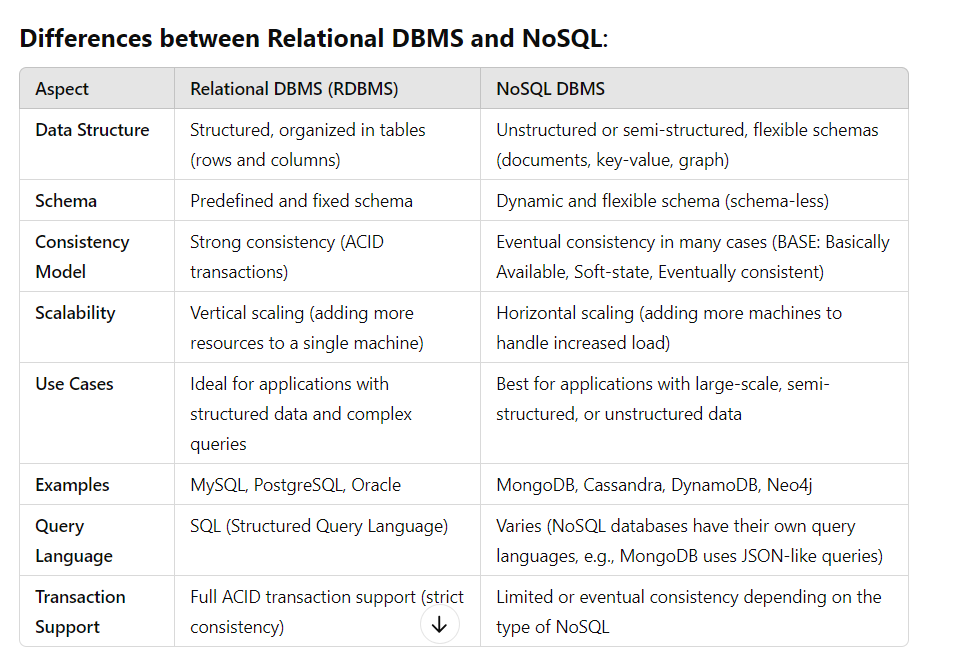

# Database Management Systems (DBMS) and Their Suitability

Database Management Systems (DBMS) are software applications that interact with users,applications, and the database itself to capture and analyze data. Different types of DBMS are designed for specific use cases and data models. Below are the main types of DBMS:

## Types of Database Management system (DBMS)

1. **Relational Database Management Systems (RDBMS)**
   RDBMS organizes data into tables (relations) with predefined schemas. Data is stored in rows and columns, and relationships between data are established using foreign keys.
   Examples: MySQL, PostgreSQL, Oracle, SQL Server.

**Suitability:**
Transactional systems: Applications with structured data and strong consistency requirements, such as banking systems, enterprise applications, and e-commerce websites.

2. **NoSQL Databases**
   NoSQL databases are designed to handle unstructured, semi-structured, and large-scale distributed data. They are more flexible than RDBMS and typically don’t use predefined schemas.

- **Types of NoSQL DBMS:**

  a. Document-oriented Databases: Examples: MongoDB, Couchbase.

**Suitability:**

Content management systems: Applications like blogs, CMS, or social media platforms where data structure may evolve over time

b. Key-Value Databases: Examples: Redis, Amazon DynamoDB, Riak.

**Suitability:**

Caching and session storage: Perfect for high-speed caching, session management, and applications where quick lookups are critical, such as e-commerce carts or real-time bidding systems.

c. Column-family Databases: Examples: Apache Cassandra, HBase.

**Suitability:**

Big data applications: Ideal for systems that handle massive amounts of data, like time-series data (e.g., IoT sensor logs) or data warehousing.

d. Graph Databases: Examples: Neo4j, Amazon Neptune, ArangoDB.

**Suitability:**

Social networks: Applications where relationships between entities are important, like friendship networks, recommendation engines, or fraud detection.

Other types of DBMS include:

Hierarchical DBMS, Network DBMS and Object-oriented DBMS.

## Differences between Relational DBMS and NoSQL:

## Web Application Framework

Web application frameworks are software frameworks that provide a structured foundation for developing web applications. They simplify the process of building applications by offering reusable code, tools, and libraries, allowing developers to focus on the application logic rather than repetitive tasks. Web frameworks can be categorized into server-side (backend) frameworks and client-side (frontend) frameworks.

**Server-side (Backend) Frameworks**
Server-side frameworks handle the application's logic, data storage, and interaction with the client. They are responsible for processing requests, managing databases, and generating responses to be sent back to the client. Here are some popular server-side frameworks: Express.js, Django, Ruby, Flask, ASP.NET Core.

**Client-side (Frontend) Frameworks**
Client-side frameworks manage the user interface and user interactions in a web application. They run in the user's browser and are responsible for rendering the UI, handling user input, and communicating with the backend. Here are some popular client-side frameworks: React, Angular, Bootstrap, jQuery.
